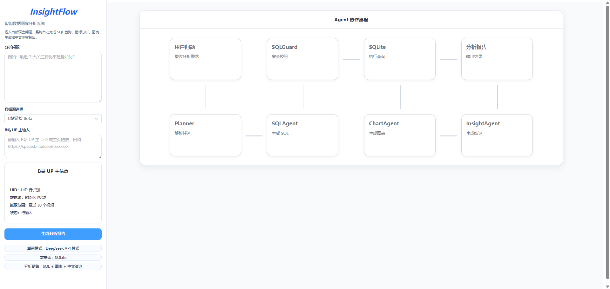
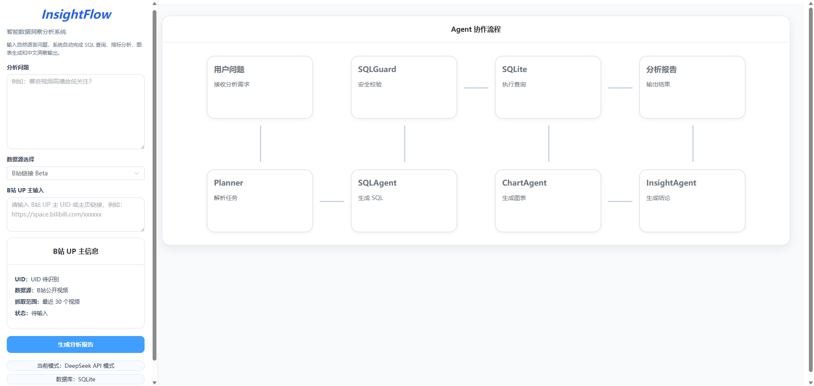
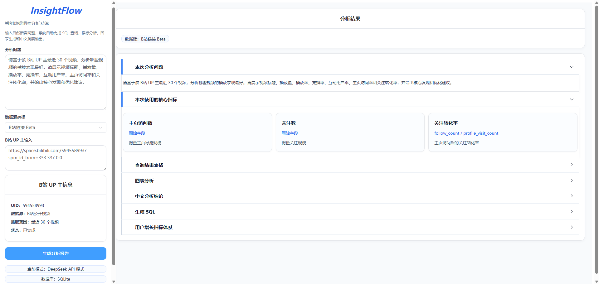
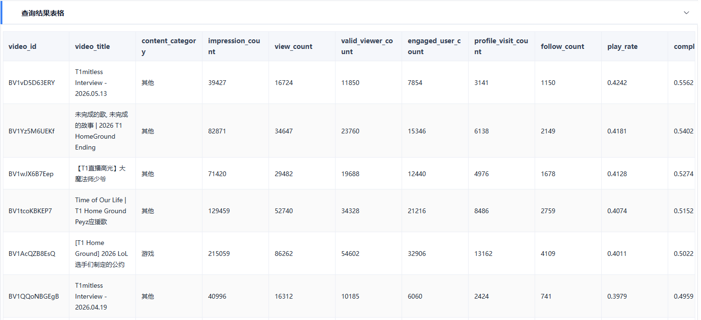
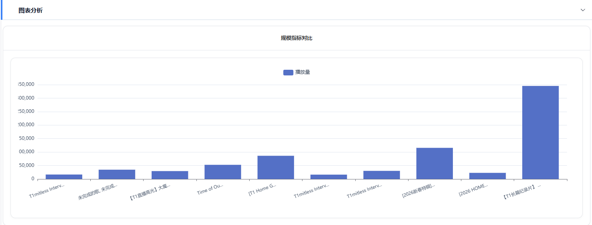
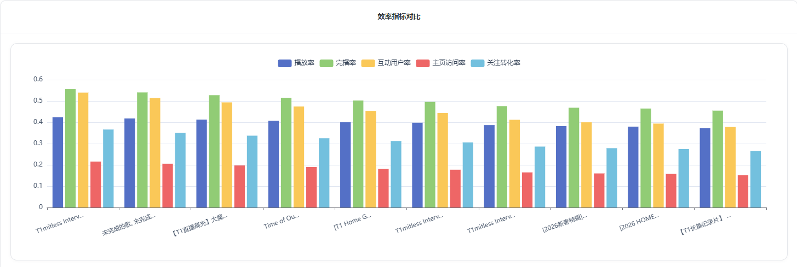
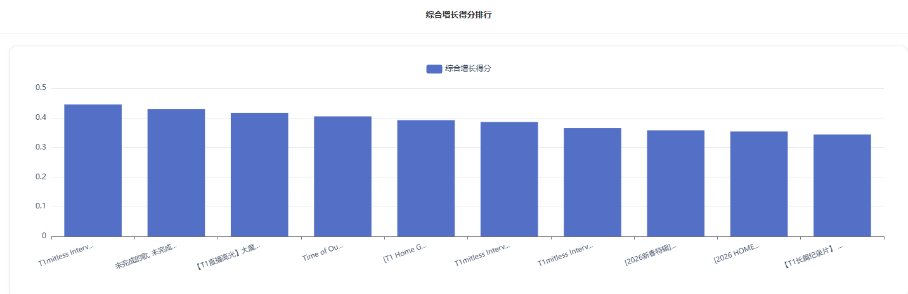
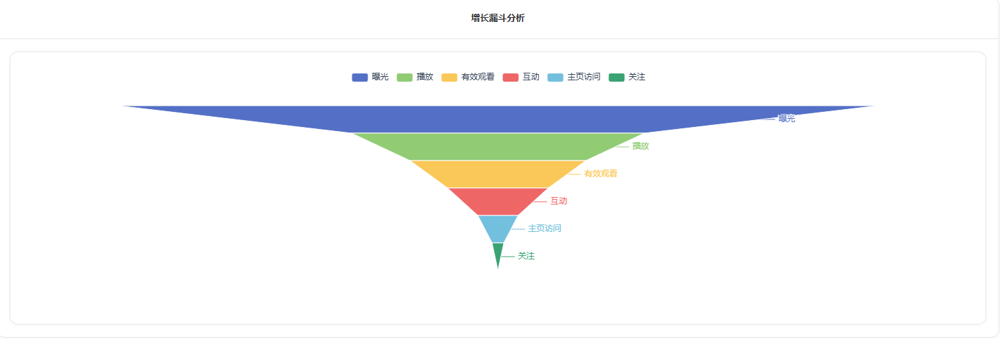
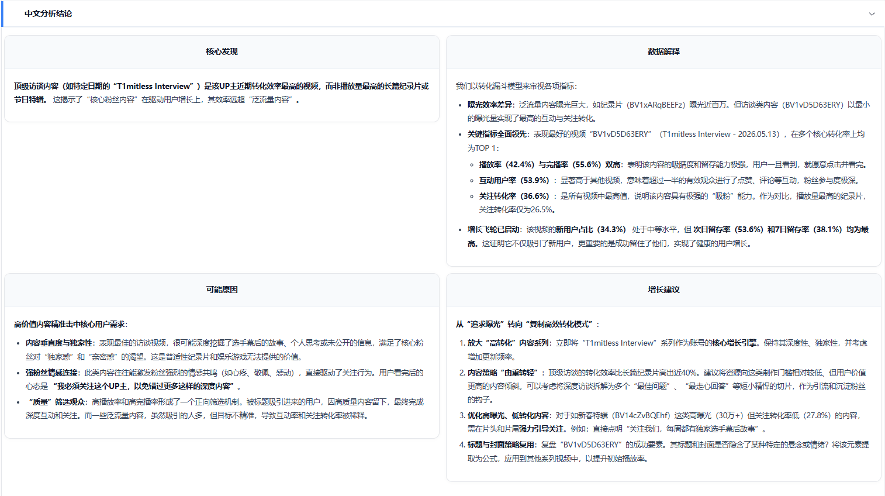


# InsightFlow｜智能数据洞察分析系统


      
InsightFlow 是一个面向数据分析场景的 AI 数据分析 Agent 项目。用户可以通过自然语言提出分析问题，系统会自动完成 SQL 生成、安全校验、数据查询、多图表展示和中文业务洞察输出。

当前版本以「内容平台用户增长分析」作为重点业务场景，接入了 B站 UP 主公开视频数据 Beta，并围绕播放、互动、主页访问、关注转化和留存等指标，构建了一套完整的数据分析与可视化流程。

---

## 项目简介

传统数据分析流程通常需要分析师手动完成数据读取、SQL 编写、指标计算、图表制作和结论总结。InsightFlow 尝试将这些步骤封装为一个 AI 数据分析 Agent 流程：

```text
自然语言问题 → SQL 生成 → 安全校验 → 数据查询 → 图表分析 → 中文业务洞察
````

用户只需要输入类似：

```text
请基于该 B站 UP 主最近 30 个视频，做一次完整的内容增长诊断。
```

系统会自动完成：

* 理解用户分析意图
* 生成 SQLite 查询语句
* 校验 SQL 安全性
* 执行数据查询
* 生成多张业务图表
* 输出中文分析结论
* 展示 Agent 协作流程

---

## 项目定位

InsightFlow 不是一个只服务于单一数据集的固定看板，而是一个可扩展的 AI 数据分析 Agent 原型系统。

当前重点场景：

* 内容平台用户增长分析
* B站 UP 主公开视频数据分析 Beta
* 内容表现、互动效率、关注转化与留存诊断

可扩展场景：

* 产品数据分析
* 用户行为分析
* 内容运营分析
* 电商经营分析
* 课程/知识付费分析
* 更多外部数据源 Connector

---

## 核心功能

### 1. 自然语言数据分析

用户可以直接输入自然语言问题，系统自动识别分析目标，并生成对应 SQL 查询。

示例：

```text
哪些视频播放量最高？
```

```text
哪些视频高播放低关注？
```

```text
哪个环节流失最大？
```

---

### 2. SQLAgent：自然语言转 SQL

SQLAgent 负责将用户问题转换为 SQLite 可执行 SQL。

当前已加入 SQLite 方言约束，避免模型生成非 SQLite 语法，例如：

* 禁止 `ANY_VALUE()`
* 禁止 `DATE_SUB()`
* 禁止 `INTERVAL`
* 禁止多条 SQL
* 只允许 `SELECT` 或 `WITH ... SELECT`

---

### 3. SQLGuard：SQL 安全校验

SQLGuard 用于防止危险 SQL 执行。

当前只允许：

```sql
SELECT ...
```

或：

```sql
WITH ... SELECT ...
```

会拦截：

* `DROP`
* `DELETE`
* `UPDATE`
* `INSERT`
* `ALTER`
* 多语句执行

---

### 4. 复杂问题降级机制

对于复杂问题，系统不会完全让大模型自由生成 SQL，而是先将问题降级为稳定的视频级综合分析任务。

例如，当用户提出：

```text
请基于该 B站 UP 主最近 30 个视频，做一次完整的内容增长诊断。
```

系统会将其转换为稳定的单 SQL 分析任务，返回视频级综合指标表，并计算 `growth_score`。

这样可以避免：

* 模型生成多条 SQL
* 使用非 SQLite 语法
* 字段不匹配
* 查询结果结构不稳定

---

### 5. 多图表分析

ChartAgent 会根据查询结果字段自动生成最多 4 类业务图表：

| 图表       | 作用                             |
| -------- | ------------------------------ |
| 规模指标对比   | 查看播放量、点赞、收藏、评论、分享等内容规模表现       |
| 效率指标对比   | 查看播放率、完播率、互动率、主页访问率、关注转化率等转化质量 |
| 综合增长得分排行 | 综合多个增长指标，识别表现最好和最差的视频          |
| 增长漏斗分析   | 定位曝光、播放、互动、主页访问、关注等环节的流失问题     |

---

### 6. InsightAgent：中文业务洞察

InsightAgent 会根据查询结果生成中文分析结论，包括：

* 核心发现
* 数据解释
* 可能原因
* 增长建议

前端支持 Markdown 渲染，并使用 DOMPurify 进行安全清洗。

---

### 7. B站 UP 主公开视频数据接入 Beta

当前版本支持输入：

* B站 UP 主 UID
* B站主页链接，例如：

```text
https://space.bilibili.com/2854995
```

系统会尝试拉取 UP 主公开视频数据，并转换为统一的数据分析表。

需要说明的是，B站公开接口主要提供内容表现数据，例如播放、点赞、评论、分享等。为了打通完整用户增长分析链路，项目会对部分增长字段进行规则模拟扩展，例如主页访问、关注转化、留存等字段。这部分用于验证分析流程和指标体系，不代表平台真实后台数据。

---

### 8. Agent 协作流程展示

前端提供 Agent 协作动态图，展示一次分析任务中的模块协作流程：

```text
用户问题 → Planner → SQLAgent → SQLGuard → SQLite → ChartAgent → InsightAgent → 分析报告
```

分析开始时，节点会依次高亮；分析成功后隐藏流程图并展示结果区。

---

## 系统架构

```text
Connectors
   ↓
Data Ingestion
   ↓
Metric Calculator
   ↓
SQLite
   ↓
SQLAgent
   ↓
SQLGuard
   ↓
SQL Executor
   ↓
ChartAgent / InsightAgent
   ↓
Frontend
```

---

## Agent 工作流

```text
用户问题
   ↓
Planner
   ↓
SQLAgent
   ↓
SQLGuard
   ↓
SQLite
   ↓
ChartAgent
   ↓
InsightAgent
   ↓
分析报告
```

各模块职责：

| 模块           | 职责                    |
| ------------ | --------------------- |
| Planner      | 解析用户问题，识别分析任务         |
| SQLAgent     | 将自然语言问题转换为 SQLite SQL |
| SQLGuard     | 检查 SQL 安全性            |
| SQLite       | 执行查询                  |
| ChartAgent   | 根据查询结果生成图表数据          |
| InsightAgent | 生成中文业务分析结论            |
| Frontend     | 展示表格、图表、SQL 和中文洞察     |

---

## 技术栈

### 后端

* Python
* FastAPI
* Pandas
* SQLite
* DeepSeek API
* OpenAI SDK Compatible API

### 前端

* Vue3
* Element Plus
* ECharts
* Markdown-it
* DOMPurify

### 数据与分析

* Demo 数据
* CSV 数据
* B站 UP 主公开视频数据 Beta
* 用户增长指标体系
* SQL 安全校验
* 多图表可视化

---

## 用户增长指标体系

| 指标    | 字段                        | 业务含义              |
| ----- | ------------------------- | ----------------- |
| 播放率   | `play_rate`               | 曝光到播放的转化能力        |
| 完播率   | `completion_rate`         | 用户是否愿意看完整个视频      |
| 互动用户率 | `engagement_user_rate`    | 用户是否产生点赞、评论、收藏等互动 |
| 主页访问率 | `profile_visit_rate`      | 用户是否对创作者产生进一步兴趣   |
| 关注转化率 | `follow_conversion_rate`  | 主页访问后是否转化为关注      |
| 新用户占比 | `new_user_ratio`          | 内容是否能触达新用户        |
| 次日留存率 | `next_day_retention_rate` | 新用户次日是否继续活跃       |
| 7日留存率 | `day7_retention_rate`     | 新用户中期留存表现         |

---

## 图表体系

InsightFlow 当前将内容增长分析拆成四个视角：

### 1. 规模指标对比

用于判断：

```text
哪个视频带来的流量和互动体量最大？
```

常见字段：

* 播放量
* 点赞数
* 收藏数
* 评论数
* 分享数
* 新增用户数

---

### 2. 效率指标对比

用于判断：

```text
哪个视频的转化质量更好？
```

常见字段：

* 播放率
* 完播率
* 互动用户率
* 主页访问率
* 关注转化率
* 新用户占比
* 留存率

---

### 3. 综合增长得分排行

用于判断：

```text
综合来看，哪些视频最值得复盘？
```

系统会基于多个增长指标计算 `growth_score`，辅助识别表现较好或较差的视频。

---

### 4. 增长漏斗分析

用于判断：

```text
用户主要流失在哪个环节？
```

漏斗链路：

```text
曝光 → 播放 → 有效观看 → 互动 → 主页访问 → 关注
```

---

## 项目截图


### 首页与 Agent 协作流程



    Agent流程运行中


### B站数据分析结果

- 测试问题：请基于该 B站 UP 主最近 30 个视频，分析哪些视频的播放表现最好。请展示视频标题、播放量、播放率、完播率、互动用户率、主页访问率和关注转化率，并给出核心发现和优化建议。
- UP主：T1电子竞技俱乐部
- 数据源：B站链接 Beta



### 查询结果表格展示（每个视频各项指标）



### 多图表分析（ChartAgent生成）
规模指标对比



效率指标对比


综合增长得分排行



增长漏斗分析



### 中文分析数据结论（由InsightAgent生成）



### SQL 查询展示（由SQLAgent生成，SQLGuard模块安全校验）


---

## 安装与运行

### 1. 克隆项目

```bash
git clone https://github.com/your-username/insight-flow.git
cd insight-flow
```

如果是在本地开发目录运行：

```bash
cd D:\Projects\mini-airda-plus
```

---

### 2. 配置环境变量

复制 `.env.example` 为 `.env`：

```bash
cp .env.example .env
```

Windows PowerShell 可以使用：

```powershell
copy .env.example .env
```

然后填写：

```env
DEEPSEEK_API_KEY=your_deepseek_api_key_here
DEEPSEEK_BASE_URL=https://api.deepseek.com
DEEPSEEK_MODEL=deepseek-chat
BILIBILI_COOKIE=your_bilibili_cookie_here
```

说明：

* `DEEPSEEK_API_KEY`：DeepSeek API Key
* `DEEPSEEK_BASE_URL`：DeepSeek API 地址
* `DEEPSEEK_MODEL`：使用的模型名称
* `BILIBILI_COOKIE`：可选，用于提升 B站数据拉取成功率

请不要将真实 `.env` 文件提交到 GitHub。

---

### 3. 启动后端

```bash
cd D:\Projects\mini-airda-plus
python -m pip install -r backend\requirements.txt
python backend\main.py
```

后端默认运行在：

```text
http://127.0.0.1:8000
```

---

### 4. 启动前端

```bash
cd D:\Projects\mini-airda-plus\frontend
npm install
npm run dev
```

前端默认运行在：

```text
http://localhost:5173
```

---

### 5. Demo 测试

```bash
cd D:\Projects\mini-airda-plus
python src/main.py --demo
```

运行时会显示当前模式：

* 有 DeepSeek Key：`DeepSeek API 模式`
* 无 DeepSeek Key：`fallback 本地模拟模式`

---

## 示例问题

可以尝试输入以下问题：

```text
哪些视频播放量最高？
```

```text
哪些视频高播放低关注？
```

```text
哪个内容分类带来的新增用户最多？
```

```text
最近 7 天关注转化率趋势如何？
```

```text
哪个环节流失最大？
```

```text
请基于该 B站 UP 主最近 30 个视频，做一次完整的内容增长诊断。
```

---

## B站数据说明

当前版本已接入 B站 UP 主公开视频数据 Beta。

支持输入UID：

```text
2854995
```

或UP主主页链接：

```text
https://space.bilibili.com/2854995
```

项目会尝试拉取该 UP 主公开视频数据，并写入本地 SQLite 数据库进行分析。

注意：

* B站公开数据接口可能受到风控、频率限制或登录态影响。
* 如果请求失败，系统会返回清晰错误提示。
* 可通过配置 `BILIBILI_COOKIE` 提高请求成功率。
* 部分增长字段为规则模拟扩展，不代表 B站后台真实数据。

---

## 项目亮点

* 使用自然语言驱动数据分析流程。
* 将 SQL 生成、SQL 安全校验、查询执行、图表生成和中文结论串成完整 Agent 链路。
* 针对复杂问题设计稳定降级机制，提高系统可用性。
* 构建内容平台用户增长指标体系。
* 支持 B站 UP 主公开视频数据 Beta 接入。
* 前端展示 Agent 协作流程、结果表格、多图表分析、SQL 和中文业务洞察。
* 保留 SQLite 轻量部署能力，适合本地演示和作品集展示。

---

## 当前限制

* B站接口可能受风控、频率或环境影响，偶发失败属于已知情况。
* 抖音入口当前为预留占位，暂未实现真实解析。
* SQLite 适合本地演示、作品集和教学场景，不定位生产级多租户系统。
* 部分增长字段为规则模拟扩展，不代表平台真实后台数据。
* 当前版本以单轮分析为主，多轮追问和任务编排仍可继续扩展。

---

## 后续优化方向

* 增加更多数据源 Connector，例如抖音、YouTube、CSV 数据仓库等。
* 支持多轮追问和上下文记忆。
* 增强 SQL 自动纠错和语义澄清能力。
* 支持异步任务、缓存和长任务进度展示。
* 支持 PostgreSQL / DuckDB 等更适合复杂分析的数据引擎。
* 生成更完整的自动化分析报告。
* 支持部署到云端，提供在线 Demo。

---

## 项目状态

当前版本为作品集项目第一版，主要用于展示 AI 数据分析 Agent 的完整链路：

```text
自然语言问题 → SQL → 查询 → 图表 → 中文洞察
```

项目重点不是生产级部署，而是验证 AI Agent 在数据分析场景中的可行性、稳定性和业务表达能力。


